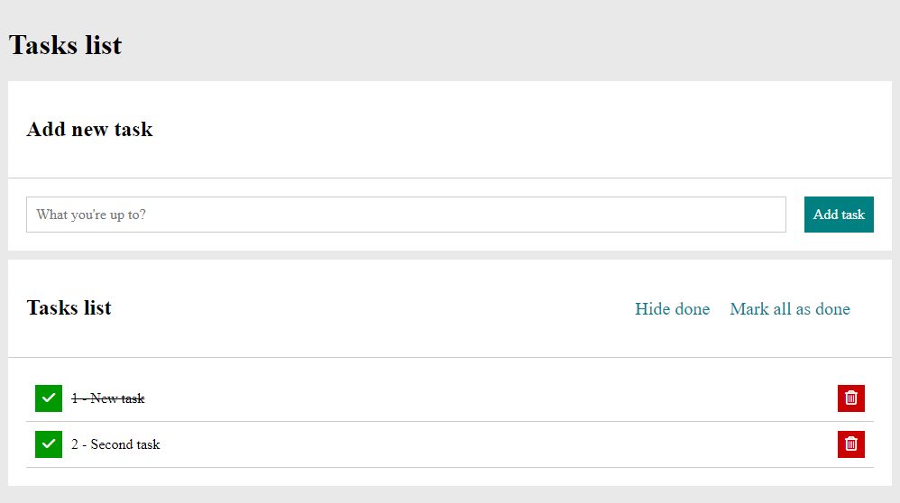
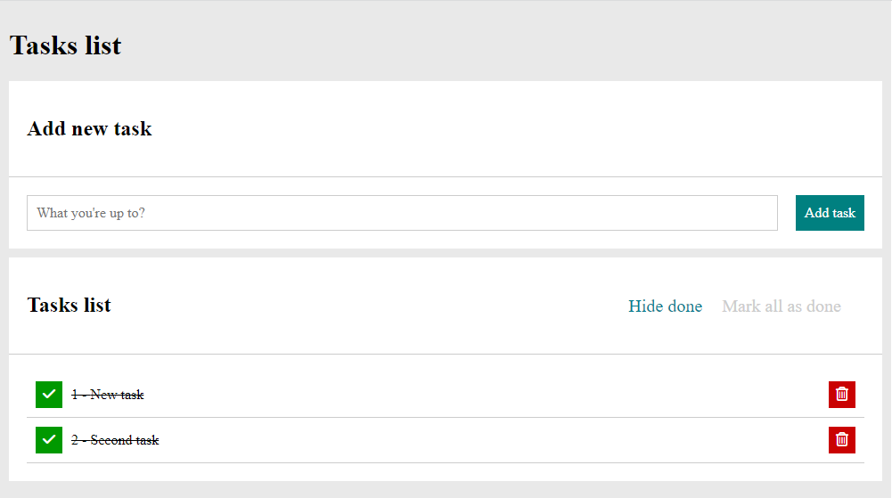
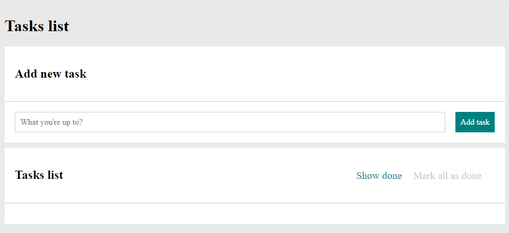

# To-do list in React.js

This project was bootstrapped with [Create React App](https://github.com/facebook/create-react-app).

## Demo

https://adrianosak.github.io/to-do-list-in-react/

## Description

This application allows you to type in and add any tasks to your to-do list.
If "Task list" is empty there is nothing there (as you can see on image below)

 but if any task is added, it appears on the list below right away, like this: 
 
 
 
 
 You can add a task simply by pressing "Enter" button on your keyboard or clicking on  button.

Since your list is not empty, the "Tasks list" are rendered with several buttons that allows you to:
- mark selected task as "done" with line-through, by clicking on green button with "checked" icon ,
- delete selected task by clicking on red button with trash icon ,
- mark all tasks as done by clicking on button .
When all tasks are marked as "done" this button remains disabled,
- hide all tasks marked as done by clicking on  button and show them back by another click.

This is how it looks like if you have couple of tasks on the list and one of them is marked as done:

If you're done with your tasks and want to check them all, this is what you'll get: 

In this case "Mark all as done" button is disabled, you can see it changed it's colour and clicking on it won't change a thing.

When you got any of your tasks done, you can hide them. Like this:
- before clicking on "Hide done" 

- after hiding done

And this is what it looks like if you're done with every single one: 

Other properties of application are:
- you can't add empty task, it won't work,
- if you use multiple spaces they won't appear in "Task list".

This is not final version of this application, I'll uprgade it with time and update this repository.

## Available Scripts

In the project directory, you can run:

### `npm start`

Runs the app in the development mode.\
Open [http://localhost:3000](http://localhost:3000) to view it in your browser.

The page will reload when you make changes.\
You may also see any lint errors in the console.

### `npm run build`

Builds the app for production to the `build` folder.\
It correctly bundles React in production mode and optimizes the build for the best performance.

The build is minified and the filenames include the hashes.\
Your app is ready to be deployed!

See the section about [deployment](https://facebook.github.io/create-react-app/docs/deployment) for more information.

### `npm run eject`

**Note: this is a one-way operation. Once you `eject`, you can't go back!**

If you aren't satisfied with the build tool and configuration choices, you can `eject` at any time. This command will remove the single build dependency from your project.

Instead, it will copy all the configuration files and the transitive dependencies (webpack, Babel, ESLint, etc) right into your project so you have full control over them. All of the commands except `eject` will still work, but they will point to the copied scripts so you can tweak them. At this point you're on your own.

You don't have to ever use `eject`. The curated feature set is suitable for small and middle deployments, and you shouldn't feel obligated to use this feature. However we understand that this tool wouldn't be useful if you couldn't customize it when you are ready for it.
